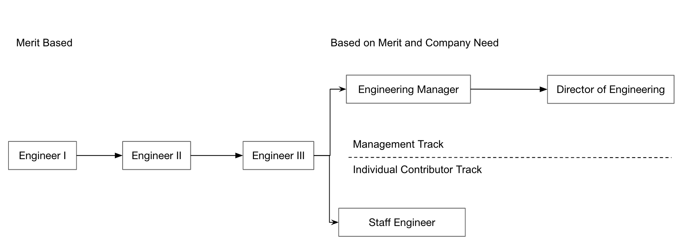

# Cado Engineering Career Ladder

We found the open-source Engineering Career Ladder from Gitlab super useful when developing our own Engineering Career ladder (https://handbook.gitlab.com/job-families/engineering/).

To that end, we've open sourced our Engineering Career Ladder (much based on Gitlab's) which may be useful for mid-size startups (20-100 people).

If you like the sound of what we're up to - we're currently hiring @ https://www.cadosecurity.com/careers/ !

## Engineer I

-   Ship moderately (1-2 weeks work) sized features and improvements with guidance and support from other team members.
-   Write code with sufficient test cases to ensure product quality.
-   Collaborate with other stakeholders within Engineering to maintain a high bar for quality in a fast-paced, iterative environment.
-   Solve technical problems of moderate (1-2 days) scope and complexity.
-   Craft code that meets our internal standards for style, maintainability, and best practices for a high-scale web environment. Maintain and advocate for these standards through code review.
-   Create your own tickets to have initiative over the day to day work you are completing.
-   Come to your 1:1s with topics for discussion and asks for self-improvement.

## Engineer II
-   Extends the Engineer I requirements.
-   Ship moderately sized features and improvements without requiring day to day guidance and support from other team members.
-   Ship large (1-3 month) features with support from other team members.
-   Advocate for improvements to product quality, security, and performance that have particular impact across your team.
-   Mentor more junior members of the team as needed.
-   Proactively investigate, fix and make improvements to prevent recurrence of customer bugs and build failures in your team's area of the code. Make it easier for other developers on your team to diagnose bugs (e.g. through pairing, documentation, improvements to logs, etc).

## Engineer III
-   Extends the Engineer II requirements.
-   Exert influence on the overall objectives and long-range goals of your team.
-   Solve technical problems of high scope and complexity.
-   Experience with performance and optimization problems, particularly at large scale, and a demonstrated ability to both diagnose and prevent these problems.
-   Advocate for improvements to product quality, security, and performance that have particular impact across your team and others.
-   Actively seek out difficult impediments to our efficiency as a team ("technical debt"), propose and implement solutions that will enable the entire team to iterate faster.
-   Author project plans for epics.
-   Take ownership of longer running projects, and provide progress updates to internal stakeholders.
-   Proactively investigate, fix and make improvements to prevent recurrence of customer bugs and build failures across the entire codebase. Make it easier for developers across your team and others to diagnose bugs.

## Staff Engineer
-   Extends the Engineer III requirements.
-   Exert influence on the overall objectives and long-range goals of the company.
-   Solve technical problems of the highest scope and complexity.
-   Shepherd the definition and improvement of our internal standards for style, maintainability, and best practices for development. Maintain and advocate for these standards.
-   Drive innovation on the team with a willingness to experiment and to boldly confront problems of immense complexity and scope.
-   Represent Cado Security and its values in public communication around broad initiatives, specific projects, and community contributions. Interact with customers and other external stakeholders as a consultant and spokesperson for the work of your team.
-   Provide mentorship for all Engineers on your team to help them grow in their technical responsibilities and remove blockers to their autonomy.
-   Confidently ship large features and improvements with minimal guidance and support from other team members. Collaborate with the team on larger projects.

## Engineering Manager
Engineering Managers at Cado see their team as their product. While they are technically credible and spend time contributing to the code-base, at least a third of their time is spent safeguarding their team's health, hiring a world-class team, and putting them in the best position to succeed. They own the delivery of product commitments and are always looking to improve productivity. They also coordinate across departments to accomplish collaborative goals.

-   Extends the Engineer III requirements, but with management responsibilities and less of an individual contributor requirement than a Staff Engineer.
-   Help your engineers grow their skills and experience.
-   Conduct code reviews, and make technical contributions to product architecture.
-   Conduct managerial interviews for candidates, and train the team to do technical interviews.
-   Make your team feel safe and supported.
-   Generate and implement process improvements.
-   Hold regular 1:1's with all members of their team.
-   Give regular and clear feedback around the individual's performance.
-   Foster technical decision making on the team, but make final decisions when necessary.
-   Improve product quality, security, and performance.

## Director of Engineering
-   Extends that of the Engineering Manager requirements.
-   Excellent communication skills.
-   Expert hiring manager skills and experience.
-   Actively seek and hire globally-distributed talent.
-   A strong people management philosophy for managers and engineers.
-   Draft quarterly OKRs and Engineering KPIs.
-   Experience managing managers.
-   Agile project management skills.
-   Ability to understand, communicate and improve the quality of multiple teams.
-   Humble, servant leader.
-   Be inquisitive: Ask great questions.
